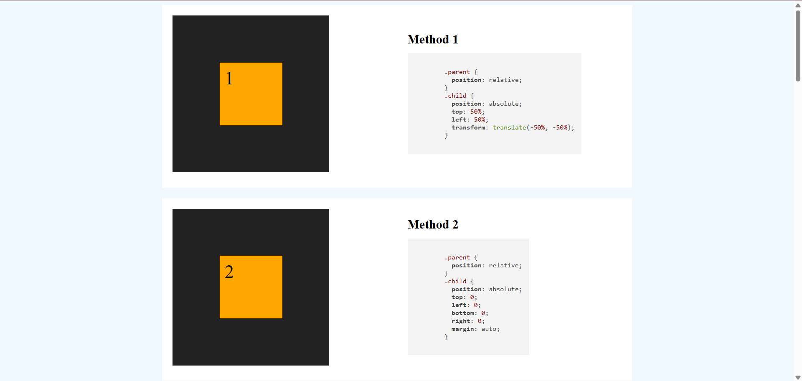

# 🎯 10 Ways to Center an Element with CSS



<p align="center">
  <a href="https://github.com/elfototo/10-Ways-to-Center-an-Element" target="_blank">
    
  </a>
  <a href="https://elfototo.github.io/10-Ways-to-Center-an-Element/" target="_blank">
    
  </a>
</p>

> **A visual guide showing 10 different methods to center an element using only HTML and CSS.**

---

## 📚 Table of Contents
- [🎯 10 Ways to Center an Element with CSS](#-10-ways-to-center-an-element-with-css)
  - [📚 Table of Contents](#-table-of-contents)
  - [🎯 Project Overview](#-project-overview)
  - [📁 Folder Structure](#-folder-structure)
  - [⚙️ Technologies Used](#️-technologies-used)
  - [🌐 Live Demo](#-live-demo)
  - [🚀 How to Use Locally](#-how-to-use-locally)
  - [🧠 Why So Many Ways?](#-why-so-many-ways)

---

## 🎯 Project Overview

This project explores **10 different ways** to center an element in CSS. Each method is implemented in a separate HTML file with visual demonstration and minimal code, making it easy to understand and compare techniques.

---

## 📁 Folder Structure

Each HTML file demonstrates one specific method for centering elements using **pure HTML and CSS**.

---

## ⚙️ Technologies Used

This project is built entirely with:


No JavaScript, no frameworks — just clean, semantic layout and styling.

---

## 🌐 Live Demo

You can view the project online via GitHub Pages:  
👉 **[Live Demo](https://elfototo.github.io/10-Ways-to-Center-an-Element/)**

Browse through each method directly in your browser.

---

## 🚀 How to Use Locally

1. **Clone the repository:**

    ```bash
    git clone https://github.com/elfototo/App_psycology_test_Maslach.git
    cd App_psycology_test_Maslach
    ```

2. **Install the dependencies (optional):**

    If you want to run the project locally and make changes, you can install the dependencies:

    ```bash
    npm install
    ```
3. **Run the project locally using Go Live (VS Code extension):**

    - If you're using **VS Code**, you can use the **Go Live** extension to start the project.
    - Simply open the project folder in **VS Code**, then click the **Go Live** button in the bottom-right corner. This will launch the application in your browser.

    Alternatively, if you prefer not to use **VS Code**, you can serve the project locally using any static server, such as **http-server**.

    To install **http-server** (if you don't have it), you can run:

    ```bash
    npm install -g http-server
    ```

    ```bash
    http-server
    ```

---

## 🧠 Why So Many Ways?

There are many ways to center things in CSS — because CSS has evolved over decades. This guide helps you:

1. Understand the pros and cons of each method
2. Learn both modern and legacy layout techniques
3. Choose the best approach for your specific project